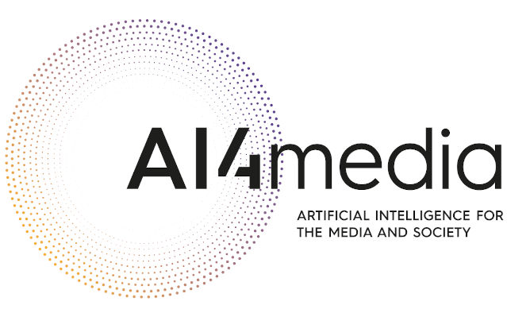

# AI4MEDIA AUTH VISIT 

This repo contains all the code developed during the AI4Media collaboration between AUTH and CATEC.

Within the context of AI4Media Task T5.2, this collaboration aims to develop advanced tools for media content production using autonomous UAVs. The aim is to learn to synthetize novel view of an environment from the image we are currently taking with the UAV and the trajectory we want to execute.

## Repo content overview

It contains three main folders: 

* [**airsim_dataset_generator**](./airsim_datasets_generator/README.md): It contains all the necessary tools for communicating with Airsim using Python as well as for generating trajectories or visualising them. This will simplify the task of generating datasets for computer vision.

* [**project**](./project/README.md): Contains the ROS nodes from the research carried out and developed in the AI4Media technical report.

* [**unreal_wiki**](./unreal_wiki/README.md): A simple wiki on how to install Unreal on Linux and integrate with Airsim.

## Acknowledgement

---

Supported by AI4MEDIA - A European Excellence Centre for Media, Society and Democracy.
More information: <a href="https://www.ai4media.eu/">ai4media.eu</a>

  

This project has received funding from the European Union's Horizon 2020  
research and innovation programme under grant agreement 951911.
