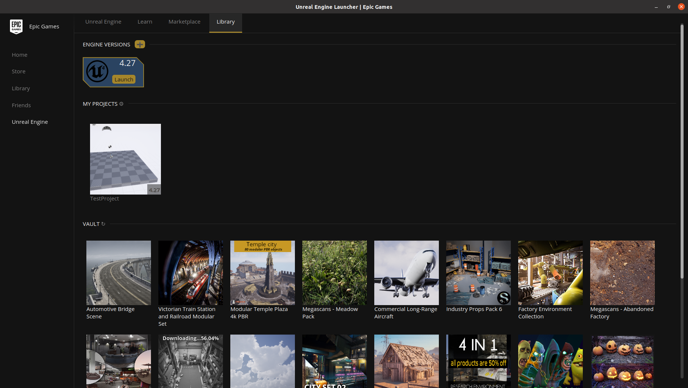
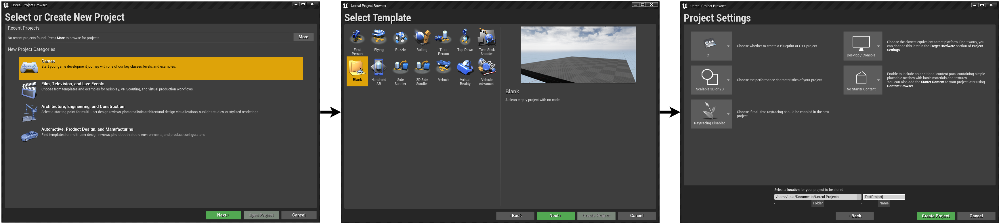
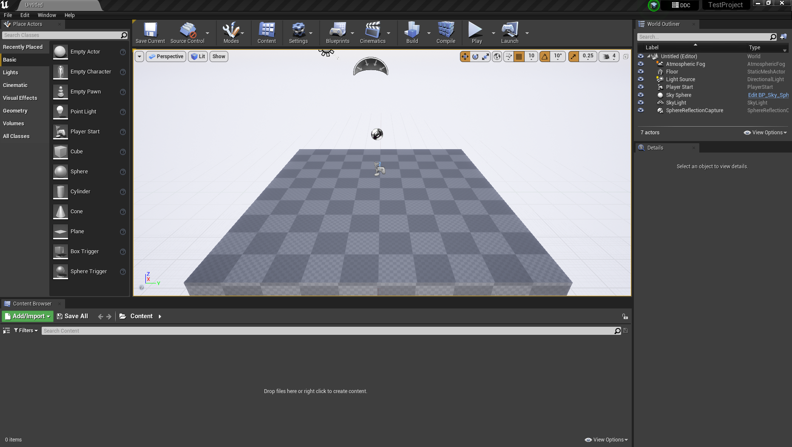
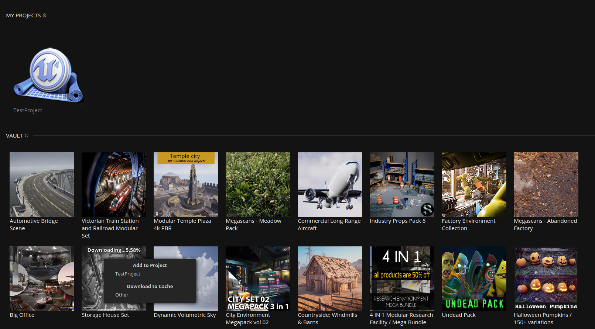
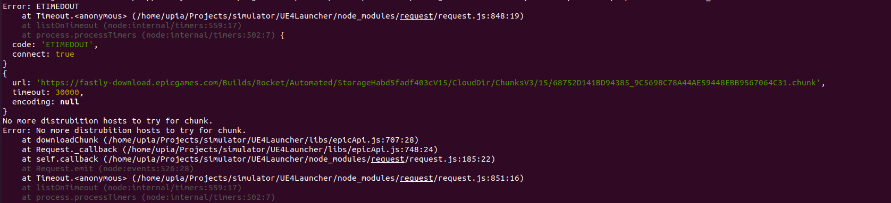
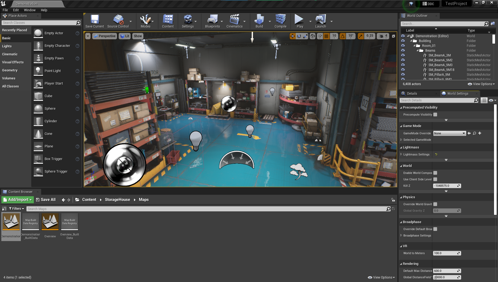

## Introduction

This section will explain how to download and run Unreal Engine 4.27 on Ubuntu 18.04/20.04 LTS. In addition, we will explain how to add the Airsim plugin and how to create and configure custom enviroments. This will allow to create realistic simulation scenarios for applications with UAVs.

[Unreal Engine (UE)](https://www.unrealengine.com/en-US/) is a 3D computer graphics game engine developed by Epic Games and written in C++. The game engine does all the graphical rendering, collision simulation and vehicle movement simulation.

[AirSim](https://microsoft.github.io/AirSim/) is a simulator for drones, cars and more, built on Unreal Engine. It is open-source, cross platform, and supports software-in-the-loop simulation with popular flight controllers such as PX4 & ArduPilot and hardware-in-loop with PX4 for physically and visually realistic simulations. It is developed as an Unreal plugin that can simply be dropped into any Unreal environment.

First of all, we will explain how to download the Unreal Editor and the Launcher, which will allow us to add custom environments to the projects we have created.

After that, we will see how to add the airsim plugin to any project we have created.

This page collects the steps followed to install the simulator fixing some encountered problems and achieving the full functionality at Ubuntu 20.04 LTS.

## Installation
To build AirSim and Unreal Engine 4 in Ubuntu 20.04 LTS the instructions are detailed in the [AirSim official page](https://microsoft.github.io/AirSim/build_linux/). But, I suggest you use the following lines which uses our forks instead of the oficial version, which fix some compilation problems and add new useful functionality.

### Unreal Engine

It is needed to be registered with Epic Games and link your github account to them to have access to the source code.

```
git clone -b 4.27-plus https://github.com/EpicGames/UnrealEngine && cd UnrealEngine

./Setup.sh

./GenerateProjectFiles.sh
    
make
```

If you have some errors during the building process, its necessary to modify two lines in the source code. Basically, you only have to comment the following lines: [VulkanDevice Stuff](https://github.com/EpicGames/UnrealEngine/blob/4.27-plus/Engine/Source/Runtime/VulkanRHI/Private/VulkanDevice.cpp#L194) and [CanvasItem Stuff](https://github.com/EpicGames/UnrealEngine/blob/4.27-plus/Engine/Source/Runtime/Engine/Private/UserInterface/CanvasItem.cpp#L382). Once you have been commented these lines, you can continue re-run building of the engine.

After having compiled the editor, it is convenient to test that it runs correctly. To do this we will use the following command inside of the Unreal Engine folder:
```
./Engine/Binaries/Linux/UE4Editor
```

If everything went well, the editor should open (It usually takes quite a long time. Especially the first time because it compiles the shaders).

### Unreal Engine Launcher (Unofficial)

In order to be able to add the enviroments downloaded from the [Unreal Marketplace](https://www.unrealengine.com/marketplace/en-US/store) to a new
project it is necessary to use an unofficial launcher.

```
sudo apt install npm

git clone https://github.com/nmrugg/UE4Launcher.git && cd UE4Launcher

npm i
npm start
```

The last line executes the launcher.

After logging in, you will be able to view both the projects you have locally and the assets associated with the account. 

It is important to add the engine version at the top, where you see the "+" icon. To do this, click and add there the path to the editor folder. 
For example, in this case: *"/home/aiiacvmllab/Documents/UnrealEngine"*. This will bring up the icon to run the editor from the launcher.

This is shown in the following image:




*Note*: no log out function is implemented! You'll need to manually erase the cache to change the logged account.
```
rm -r ~/.config/ue4launcher ~/.config/Electron
```


### Creating First Project

#### Creating a New Project in UE4Editor

in order to create a new project it is necessary to choose the category of the project, the language used and some other settings.
To do this, first of all it is necessary to open the editor:

```
./UnrealEngine/Engine/Binaries/Linux/UE4Editor
```

Then choose "game" as the project category. In addition, an empty template will be chosen. Finally, choose C++ instead of blueprint and
the name of the project.
The following image shows the workflow for creating a new project in the unreal engine editor.



If everything went well, you should open the editor with the empty project you just created. This is shown in the following image:



#### Recommended changes to proper compilation

In order to be able to compile the project and generate our "game" (or simulation environment) it is convenient to make the following changes
in the editor:

* Disable Virtual Reality Plugins: Oculus VR / Steam VR (Edit/Plugins)

* Select the following settings (Settings/Project Settings):

    * Editor Startup Map: select your map

    * Game Default Map: select your map

* Disable the CPU saving when window is minimized (Edit/Editor Preferences):

    * Disable 'Use less CPU' option.

* Enable the command console for running games (Edit/Editor Preferences):

    * <span style="color:red">*TODO: Fill*</span>

#### Generate Launch File

<span style="color:red">*TODO: Improve this section*</span>

* Package your project in order to generate an executable (File/Package Project/Linux/Linux)

* Run:

```
./LinuxNoEditor/YourProjectName.sh -windowed
```

* *Note:* If you import your AirSim client library in your Unreal C++ class, you will need to add in the constructor located in the generated file YourProjectName.Target.cs the following line:

```
bForceEnableExceptions = true;
```

### Adding custom enviroments to your project

Once a base project has been created, the assets necessary for the development of the target simulation environment will be added.

To do this, the asset we want to use must be associated in the [MarketPlace](https://www.unrealengine.com/marketplace/en-US/store) to the account we have logged into the UE4 Launcher.

Next, we will show the example of how to associate the "Storage House Set" environment to the project we have previously created, "TestProject".

To do this, right click in UE4Launcher on the asset you want to start and choose the project to which you want to associate it. This will start the download process. Once it finishes, if it does it correctly, we will be able to open our project with the new environment.



If during the download an asset chunk timeout error occurs, just try to download it again and it will continue with the last one that was downloaded correctly.



Another possible option is that, instead of directly associating the enviroment to the project, you can download it to the cache and associate it afterwards.

When the download completes successfully, it is time to open the unreal editor. To do this, instead of running it as before, we will also pass the path to the project we want to open. This is convenient so that it takes less time to open the IDE. 

```
/Engine/Binaries/Linux/UE4Editor /home/aiiacvmllab/Documents/Unreal\ Projects/TestProject/TestProject.uproject
```

Once the editor opens, at the bottom we have the "Content Browser". To open the demonstration map of the environment we have attached, we navigate to 
"Content/StorageHouse/Maps" in this browser and open "Demonstrator". The result should be similar to the one shown in the following image.



With this, we already have a custom project with the simulation environment we want.