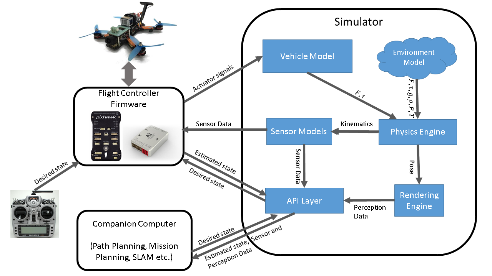
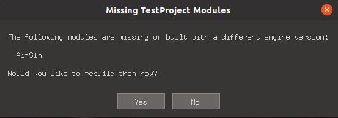
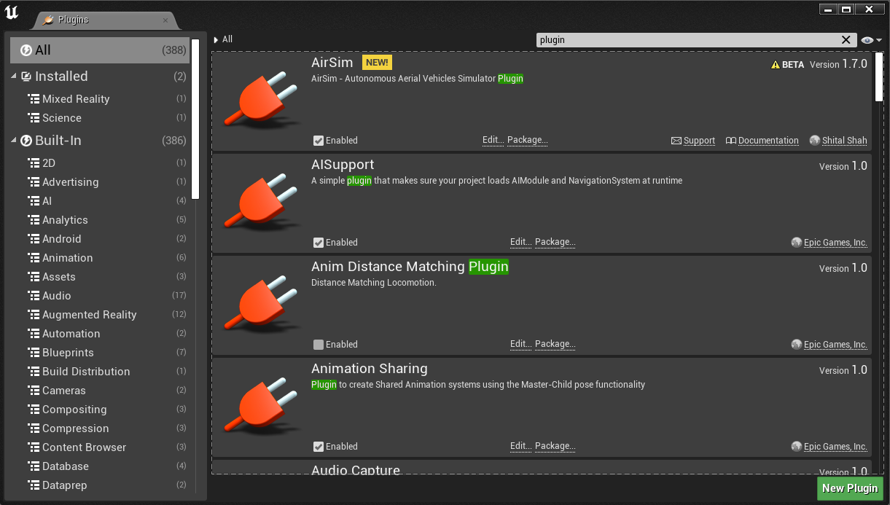

## Adding AirSim to your project

Before starting it is necessary to have created an Unreal Project. This is because AirSim works as a plugin of a project.

It is convenient to have a look at the [Airsim Wiki](https://microsoft.github.io/AirSim/) to understand how it works and details that are not covered in this wiki. You can also read the [original paper](https://microsoft.github.io/AirSim/paper/main.pdf).


Below, is an overview of how the different airsim modules interact with each other.



In what follows in this guide, the flight controller firmware will be employed using in the loop software and, to extract all the sensing data, it will be done by means of a ROS wrapper.

## Download and build AirSim

First, you must download AirSim from the custom version you have. After that, we follow the next steps to configure and compile it:

```
git clone https://github.com/microsoft/AirSim && cd AirSim

./setup.sh

./build.sh
# use ./build.sh --debug to build in debug mode
```

## Adding AirSim as UE4 Plugin

Once the AirSim plugin has been built, it is time to add it to our custom Unreal Project. To do this, we must create the plugins folder inside our custom project and copy the contents of the folder "Unreal/Plugins/Airsim" to the plugins folder of our project.

In this particular case, the path to our custom project is:  **/home/aiiacvmllab/Documents/Unreal\ Projects/TestProject**.

```
mkdir -p /home/aiiacvmllab/Documents/Unreal\ Projects/TestProject/Plugins
rsync -a --delete Unreal/Plugins/AirSim /home/aiiacvmllab/Documents/Unreal\ Projects/TestProject/Plugins
```

Once the plugin has been added, it is time to re-run the UE4 Editor to make sure everything went correctly. 
To do this, we use the following command:
```
cd /home/aiiacvmllab/UnrealEngine && \
./Engine/Binaries/Linux/UE4Editor /home/aiiacvmllab/Documents/Unreal\ Projects/TestProject/TestProject.uproject
```

If after executing it the following pop-up appears indicating that the plugin must be rebuilt, we must use the *UnrealBuildTool*.



This tool needs to be passed as argument the path to the uproject of our custom project.

```
cd /home/aiiacvmllab/UnrealEngine && \
./Engine/Binaries/ThirdParty/Mono/Linux/bin/mono Engine/Binaries/DotNET/UnrealBuildTool.exe Development Linux -Project=/home/aiiacvmllab/Documents/Unreal\ Projects/TestProject/TestProject.uproject -TargetType=Editor -Progress
```

After executing this command, we will run the editor again with our project. If everything went well, the UE4 editor will open normally.

If we open the plugins manager (Edit/Plugins) and check that airsim is there, everything went correctly.
Congratulations, you have survived this!



## Configuring drone start and UE4 game mode

<span style="color:red">*TODO: Hablar de que hay que cambiar el modo de juego por defecto a AirSimGameMode y definir el player start con pantallazos 
del editor*</span>
